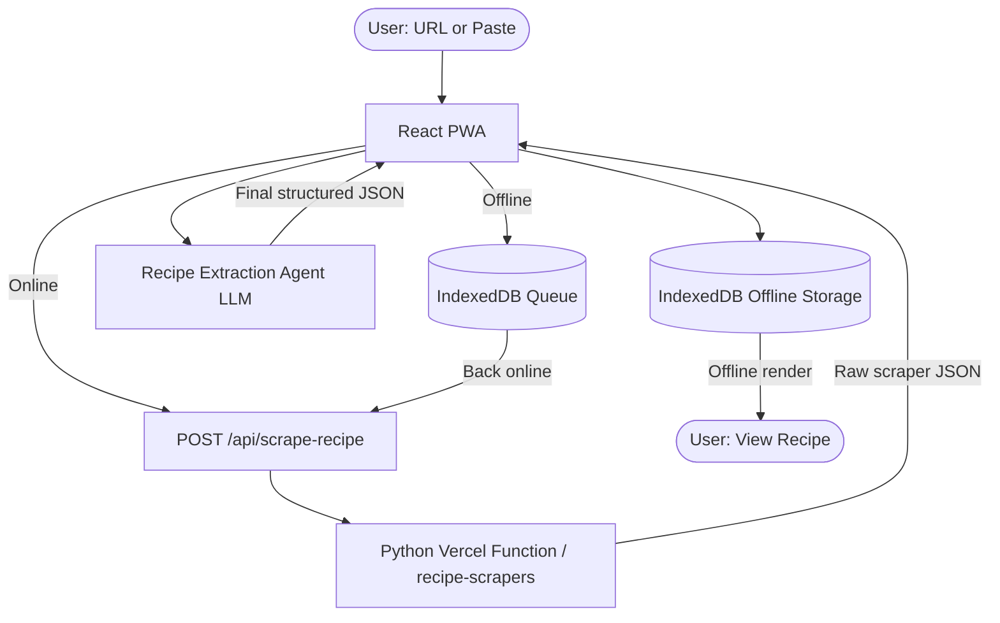

# Integrating `recipe-scrapers` on Vercel

This app is a **React + TypeScript PWA** deployed on **Vercel**. We add a tiny **Python scraper backend** using the `recipe-scrapers` library, also running on Vercel, to fetch and parse recipe pages. The **Recipe Extraction Agent** (LLM) already exists and knows the target JSON schema. It does not fetch HTML; it only transforms the scraper's JSON.

---

## Architecture Overview

- **Frontend:** React + TypeScript PWA (Vercel).
- **Scraper backend:** Python serverless function on Vercel using `recipe-scrapers`.
- **Agent:** LLM that converts raw scraped JSON into the final structured recipe JSON.

### Data Flow

1. User enters a recipe URL (or paste) in the PWA.
2. React calls `POST /api/scrape-recipe` (Python on Vercel).
3. Python uses `recipe-scrapers` to fetch and parse the recipe page and returns **raw scraper JSON**.
4. React sends that JSON (plus the URL) to the Recipe Extraction Agent.
5. The agent returns the **final structured recipe JSON**, which the PWA stores in IndexedDB for offline use.

---

## Vercel + Python Setup

We place a Python function in the **same Vercel project** as the React app:

- `package.json` etc. for React.
- `requirements.txt` for Python:
  - `recipe-scrapers`
  - `fastapi` and `uvicorn` (optional, if using FastAPI).
- `api/scrape_recipe.py` as the Python function.

Vercel will detect `requirements.txt` and `api/*.py` and deploy a Python serverless function exposed at `/api/scrape-recipe`.

---

## Scraper Endpoint Contract

### Request (React to Python)

POST /api/scrape-recipe
Content-Type: application/json

Body:
{
  "url": "https://example.com/some-recipe"
}

(We can extend later to support "rawHtml" / "rawText".)

### Python Logic Sketch (api/scrape_recipe.py)

from recipe_scrapers import scrape_me

def handler(request):
    data = request.json()
    url = data["url"]
    scraper = scrape_me(url)
    raw = {
        "title": scraper.title(),
        "ingredients": scraper.ingredients(),
        "instructions": scraper.instructions(),
        "yields": scraper.yields(),
        "total_time": scraper.total_time(),
        "image": scraper.image(),
        "host": scraper.host(),
        "language": scraper.language(),
    }
    return Response(json=raw, status=200)

### Response (Python to React)

Example:
{
  "title": "Spaghetti Carbonara",
  "ingredients": ["8 oz spaghetti", "2 large eggs", "1/2 cup grated Parmesan", "4 oz pancetta"],
  "instructions": "Boil pasta...\nCook pancetta...\nMix eggs and cheese...",
  "yields": "2 servings",
  "total_time": 25,
  "image": "https://example.com/image.jpg",
  "host": "example.com",
  "language": "en"
}

This is **raw scraper JSON**, not yet the final schema.

---

## Connection to the Recipe Extraction Agent

The frontend calls the agent with:
{
  "scrapedRecipe": { /* JSON from /api/scrape-recipe */ },
  "sourceUrl": "https://example.com/some-recipe"
}

The agent:
- Takes scrapedRecipe + sourceUrl.
- Produces the final structured recipe JSON (the schema it already knows).
- Handles missing fields gracefully (e.g., if times or yields are absent).

---

## PWA and Offline Behavior

- If online: PWA calls /api/scrape-recipe, then calls the agent, then stores final JSON in IndexedDB.
- If offline: PWA queues the URL and waits until online to hit /api/scrape-recipe. Previously processed recipes are served from IndexedDB.

---

## Assumptions

- Scale: ~50-150 recipes for MVP; Vercel free tier is sufficient.
- /api/scrape-recipe is the only scraping entry point.
- All transformation into the final schema is done by the Recipe Extraction Agent.
