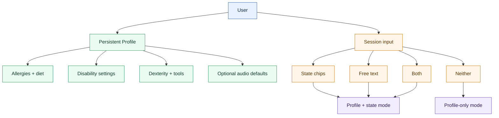
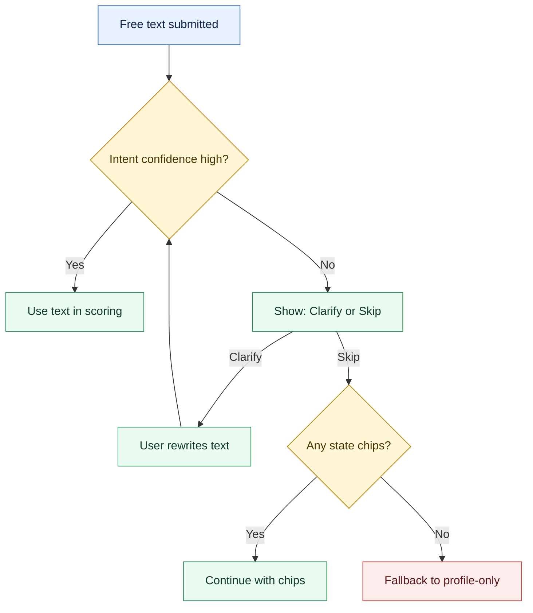
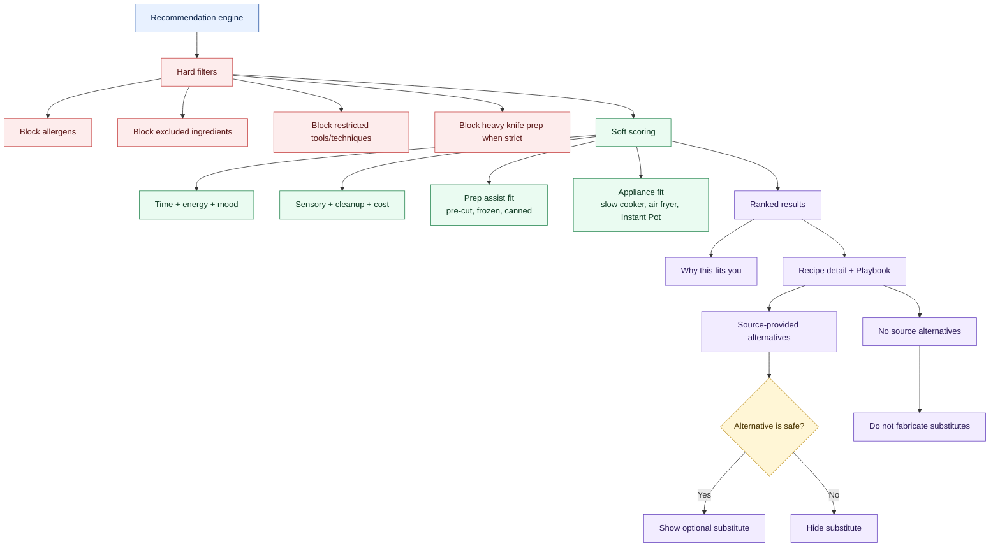
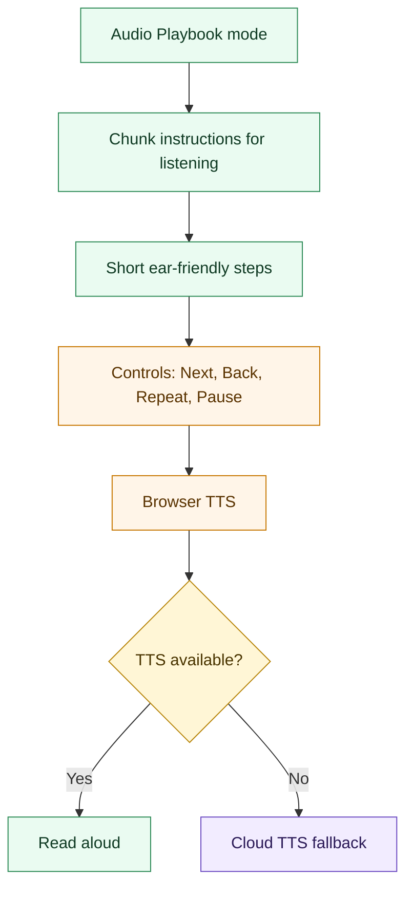
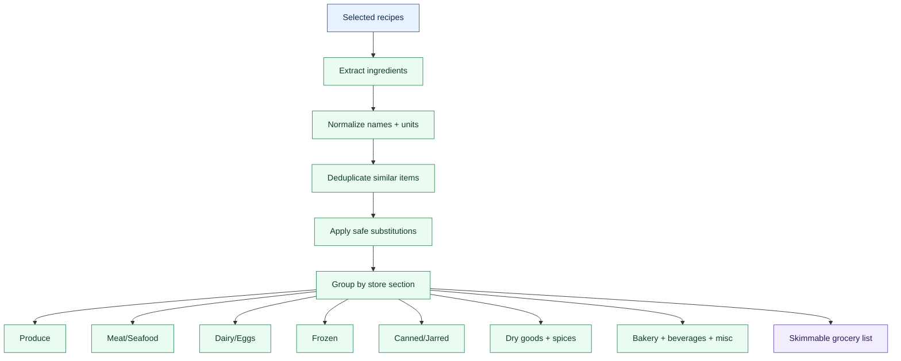
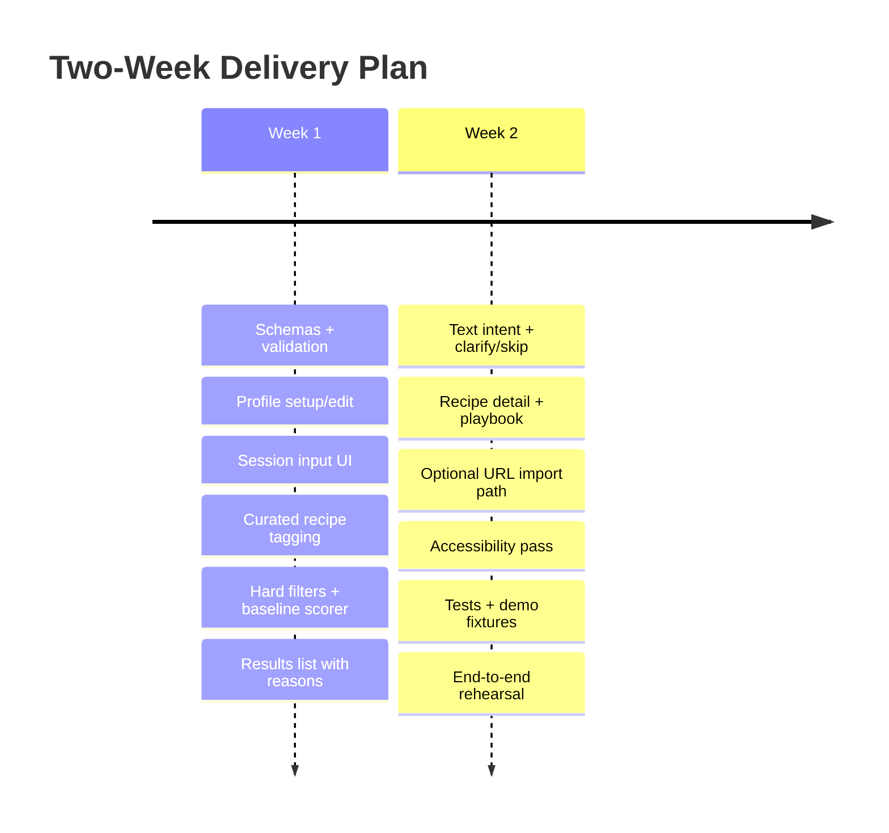
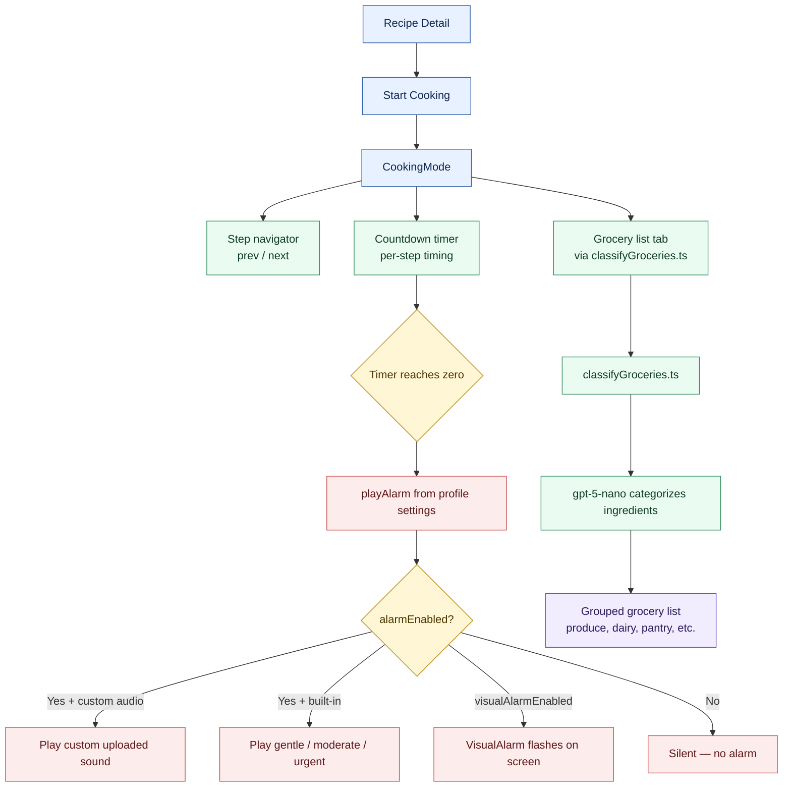
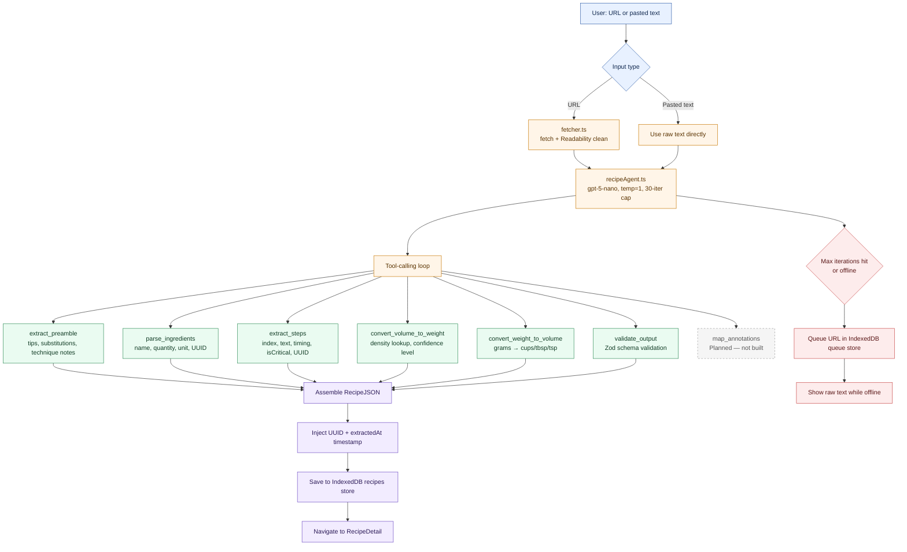

<!-- Last updated at commit: 26eff09 (26eff093078e89e93dfd2536b65f0de122e5c15e) on 2026-03-07 | branch: main -->
# Simmer Plan Overview

## Table of Contents

- [🧩 1) User Inputs and Modes](#1-user-inputs-and-modes)
- [💬 2) Text Intent Handling](#2-text-intent-handling)
- [🔍 3) Recommendation Pipeline](#3-recommendation-pipeline)
- [🔊 4) Stretch Goal: Audio Playbook](#4-stretch-goal-audio-playbook)
- [🛒 5) Grocery List View](#5-grocery-list-view-built--now-in-cookingmode)
- [📅 6) Two-Week Delivery Timeline](#6-two-week-delivery-timeline)
- [🍳 7) CookingMode Flow](#7-cookingmode-flow-built)
- [🤖 8) Extraction Agent Flow](#8-extraction-agent-flow-built)
- [🗺️ Legend](#legend)

---

## 1) User Inputs and Modes

## 2) Text Intent Handling

## 3) Recommendation Pipeline

## 4) Stretch Goal: Audio Playbook

## 5) Grocery List View [Built — now in CookingMode]

## 6) Two-Week Delivery Timeline

## 7) CookingMode Flow [Built]

## 8) Extraction Agent Flow [Built]

Legend:
- Blue: user/input context
- Green: primary actions and scoring
- Yellow: decisions
- Red: safety or fallback constraints
- Purple: outputs, modes, and fallback systems
- Grey dashed: planned but not yet built
